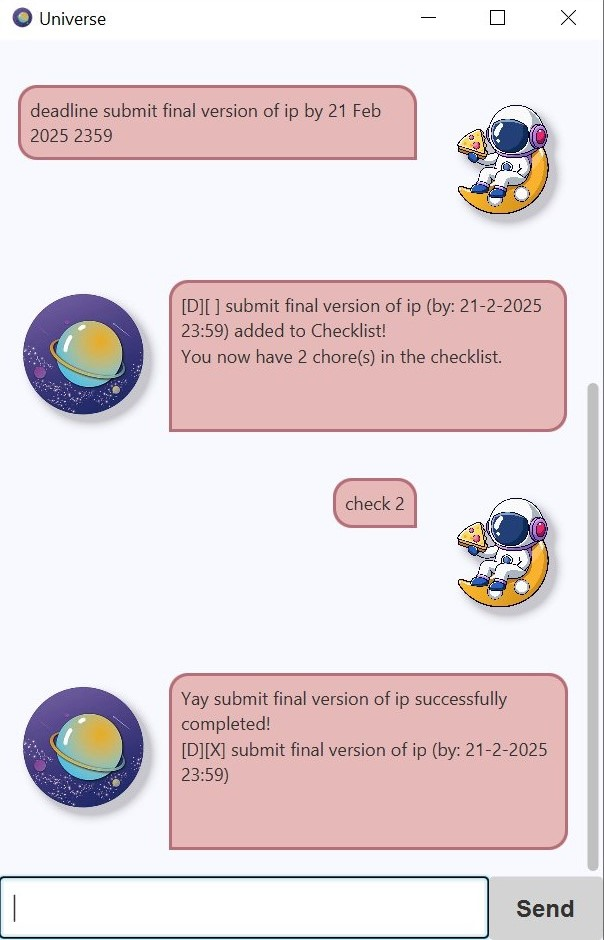

# Universe User Guide
#### Welcome to the Ultimate Guide to the Universe!

Meet **Universe**, a chatbot that caters to all your task managing needs.

Universe keeps track of your tasks in a Cosmic Chore Checklist, where you can 
+ add a Chore
+ delete a Chore
+ mark a Chore as completed
+ mark a Chore as not completed
+ view all the Chores in the Checklist
+ find all the Chores due or happening on the same date
+ find all the Chores with the same keyword
+ clear the Checklist
+ ask for the list of approved commands

Please refer to the sections below for additional information on the input format.

Note that 
+ the items in the brackets () MUST be provided by the user
+ there can only be one parameter in each bracket.

## Getting help
Shows a list of approved commands.

Format:`help`

## Adding a Chore
Adds a Chore, which can be of 3 different types:
1. ToDo - represents a task that can be completed anytime.
2. Deadline - represents a task that must be completed before a specified deadline.
3. Event - represents a task that happens from a start date/time to an end date/time.

Format: 
1. `todo (chore description)`
2. `deadline (chore description) by (date and time in D MMM YYYY HHmm format)`
3. `event (chore description) from (date and time in D MMM YYYY HHmm format) to (date and time in D MMM YYYY HHmm format)`

Examples: 
1. `todo study for pl1101e test`
2. `deadline cs2103t ip work by 21 Feb 2025 2359`
3. `event cca meeting from 19 Feb 2025 2000 to 19 Feb 2025 2200`

Confirms the successful addition of the Chore by sending a confirmation message
and showing the current number of chores in the checklist. 

> Note that the end date and time for an event must not be earlier or equal to the start end date and time. 
> If entered incorrectly, Universe will prompt user to reenter the command.

## Viewing all Chores in the Checklist
Views the contents of the Cosmic Chore Checklist and their completion status.

Format: `list`

## Marking a Chore as completed
Marks a Chore (applicable to all 3 Chore types) as completed, with the status reflected in the Checklist.

Format: `check (chore number)`

Example: `check 1` marks the first chore in the list as completed.

## Marking a Chore as NOT completed
Marks a Chore (applicable to all 3 Chore types) as not completed, 
with the status reflected in the Checklist.

Format: `uncheck (chore number)`

Example: `uncheck 2` marks the second chore in the list as not complete.

## Removing a Chore
Removes a Chore (applicable to all 3 Chore types) from the Checklist.

Format: `remove (chore number)`

Example: `remove 3` deletes the third chore from the list.

## Filtering Checklist by date
Finds all the Chores due or happening on the same date.

Format: `filter (date in D MMM YYYY format)`

Example: `filter 23 Feb 2025` finds all the chores due or happening on 23 February 2025.

## Finding a Chore in the Checklist containing the keyword
Finds all the Chores with the same keyword in the description.

Format: `find (keyword)`

Example: `find meet` will return 2 Chores if one Chore has the word "meet" and the other has the word "meeting".
> Note that Universe supports flexible search such that the keyword can be a subset of the actual keyword.

## Deleting all the Chores from the Checklist
Clears the content of the Checklist.

Format: `clear`

## For fun 
Greets the user and asks if help is needed.

Format: `hi`

Expected output: `Greetings Universe traveller! Type 'help' if you need the commands list.`

_______________________________________________________________________________________________________

## Download instructions
Follow the steps below to run Universe:
1. Download it [here](https://github.com/yuqing-tham/ip/releases/tag/A-Release)
2. Once the JAR file is downloaded, please `cd` to the correct folder where the file is located.
3. Run the following command `java -jar Universe.jar`.
4. You're all set to interact with Universe! 